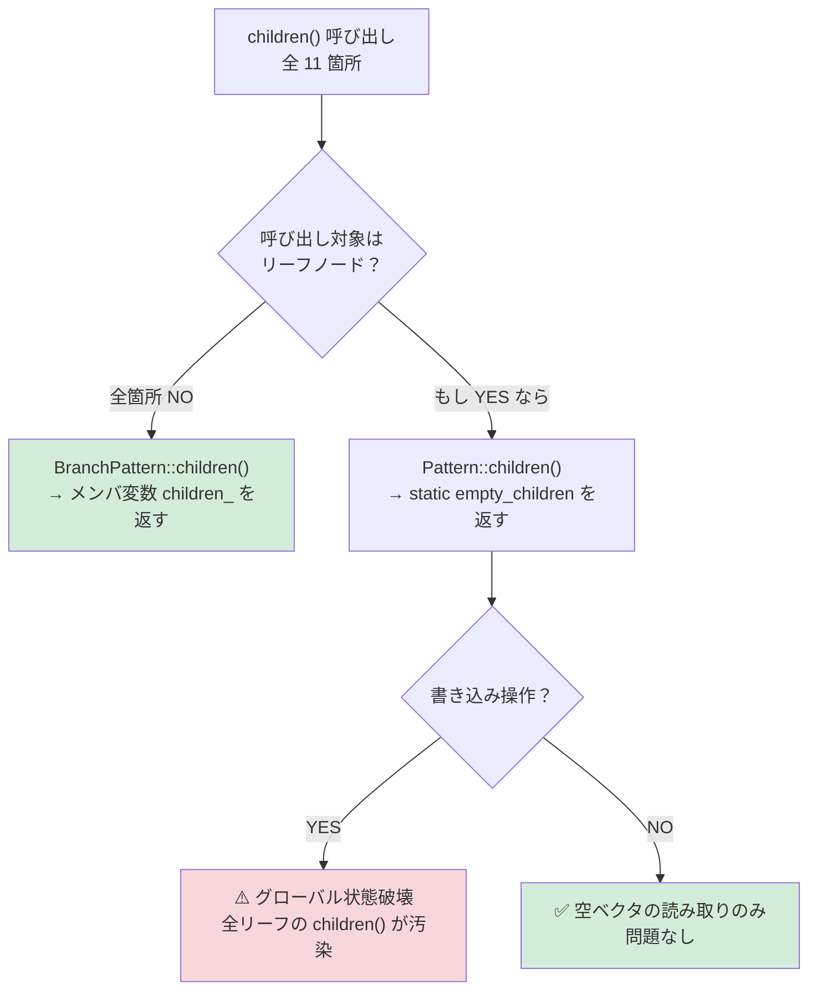

# docopt.cpp03 コードレビュー & テストカバレッジ報告書

**レビュー日**: 2026-09-06
**対象**: コードベース全体（`docopt.h`, `docopt_private.h`, `docopt.cpp`, `unit_tests.cpp`, `test_docopt.cpp`, サンプルコード, ドキュメント一式）

**使用 LLM モデル**:

| 役割 | モデル |
|:---|:---|
| オーケストレーション・統合分析・詳細コード検証 | Claude Opus 4.6 (Thinking) |
| コアライブラリレビュー（設計・安全性・品質） | Gemini 2.5 Pro |
| テストカバレッジレビュー | Gemini 2.5 Pro |
| ドキュメント・サンプルコードレビュー | Gemini 2.5 Flash |

> [!NOTE]
> 本レポートは過去のレビュー（v1.4.0 `feature/unify-value-accessors-to-templates` ブランチ、commits `8a35575`〜`7db4e97`）の結果を包含・更新した包括的レビューです。

---

## 1. 総合評価サマリー

| 観点 | 評価 | 概要 |
|:---|:---:|:---|
| **アーキテクチャ・設計** | ✅ 良好 | 正規表現に依存しない AST ベースのパーサ。C++03 制約下で合理的な設計 |
| **メモリ安全性** | ✅ 修正済み | 過去の UAF (CWE-416)、境界外読取 (CWE-125)、空文字列 UB (CWE-758) は全て解消 |
| **API 設計** | ✅ 良好 | テンプレート・CamelCase 互換の二重 API、フォールバック付きアクセサ、例外階層が充実 |
| **テストカバレッジ** | ⚠️ 概ね良好（欠落あり） | 76 件の単体テスト + 957 行の Python 準拠機能テスト。ただし重要な未テスト領域あり |
| **ドキュメント** | ✅ 修正済み | README と実装の齟齬解消、スレッドセーフティ追記、CHANGELOG リファレンスリンク・分類修正完了 |

---

## 2. コード品質レビュー（深刻度順）

### 🟢 Low: 静的ローカル変数への非 const 参照の返却（設計上の問題）

**箇所**: [docopt.cpp:L369-372](../docopt.cpp#L369-L372) `Pattern::children()`

```cpp
// Pattern 基底クラス（リーフノード用デフォルト実装）
virtual std::vector<PatternPtr>& children() {
    static std::vector<PatternPtr> empty_children;
    return empty_children;
}

// BranchPattern（ブランチノード用オーバーライド）— docopt.cpp:651
virtual std::vector<PatternPtr>& children() { return children_; }
```

**問題**: 基底クラス `Pattern` がリーフノード向けに **`static` ローカル変数への非 `const` 参照**を返しています。万一呼び出し側がこの参照を通じて要素を追加・変更すると、プロセス全体で共有される唯一の `static` ベクタが汚染され、全リーフノードのグローバル状態が破壊されます。

#### 呼び出しサイトの網羅的トレース結果

`children()` の全 **11 箇所**の呼び出しを書き込み操作と読み取り操作に分類しました。

**書き込み操作（5 箇所）:**

| # | 箇所 | コード | リーフで呼ばれるか？ |
|:-:|:---|:---|:---:|
| W1 | [L875](../docopt.cpp#L875) | `child_list = children(); ... child_list[i] = ...` | ❌ [L855](../docopt.cpp#L855) `is_leaf()` ガード |
| W2 | [L880](../docopt.cpp#L880) | `child_list[i] = (*uniq)[j];` | ❌ W1 と同じガード内 |
| W3 | [L892](../docopt.cpp#L892) | `either_children = transformed->children();` | ❌ `transform()` は `Either`（ブランチ）を返す |
| W4 | [L895](../docopt.cpp#L895) | `case_children = either_children[i]->children();` | ❌ `Either` の子は `Required`（ブランチ） |
| W5 | [L1544](../docopt.cpp#L1544) | `options_shortcuts[i]->children() = children;` | ❌ `OptionsShortcut` は `BranchPattern` 派生 |

**読み取り操作（6 箇所）:**

| # | 箇所 | コード | リーフで呼ばれるか？ |
|:-:|:---|:---|:---:|
| R1 | [L952](../docopt.cpp#L952) | `child->children().size()` | ❌ [L941](../docopt.cpp#L941) `!is_leaf()` が前提条件 |
| R2 | [L954](../docopt.cpp#L954) | `child->children()[c]` | ❌ 同上 |
| R3-R4 | [L960-961](../docopt.cpp#L960-L961) | `child->children().begin()/.end()` | ❌ `KIND_ONE_OR_MORE` はブランチ |
| R5 | [L966](../docopt.cpp#L966) | `child->children().begin()/.end()` | ❌ else 節（`Required`/`Optional` 等ブランチ） |
| R6 | [L651](../docopt.cpp#L651) | `return children_;` | — `BranchPattern` 自身のオーバーライド |

#### 分析結論



> [!IMPORTANT]
> **現在のコードフローでは、`Pattern` 基底クラスの `children()`（静的ローカル変数版）が書き込み操作で呼ばれるパスは存在しません。** 全ての書き込みサイトには `is_leaf()` ガード、`transform()` の戻り値型制約、または `flat()` のフィルタリングによる保護が存在します。

ただし、**将来のコード変更でリーフノードに対して書き込みが行われてもコンパイラが一切警告しない**点は設計上の欠陥です。一度 `static` ベクタが汚染されると全リーフの `children()` にゴミデータが見え、デバッグが極めて困難になります。

**推奨対応**（次のリファクタ機会に）:
- `const std::vector<PatternPtr>&` を返すように変更し、書き込みには `BranchPattern` 専用の `mutable_children()` を導入する
- これによりリーフへの書き込みがコンパイルエラーとなり、静的に防止できる

---

### ℹ️ Informational: 過去レポートと現在の例外型の差異

**箇所**: [docopt.cpp:L154-234](../docopt.cpp#L154-L234) `Value::as<T>()` の各特殊化

**内容**: 過去の調査レポート [value_conversion_methods_investigation_report.md](./value_conversion_methods_investigation_report.md)（v1.2.4 以前）では型変換失敗時に `std::runtime_error` をスローすると記録されていましたが、現在の実装およびテストは `boost::bad_lexical_cast`（`std::bad_cast` 派生）を一貫して送出します。過去レポートは当時の経緯記録として維持し、現行仕様は README および単体テストにて管理されます。


---

### 🟡 ~~Medium: スレッドセーフティの非保証（文書化不足）~~（✅ 修正完了）

**箇所**:
- [docopt.cpp:L147-152](../docopt.cpp#L147-L152) `Value::as_string_list()` — `const` メソッドが `mutable` メンバを変更（遅延キャッシュ）
- [docopt.h:L160](../docopt.h#L160) `Options::operator[] const` — C++03 では関数内 `static` 変数の初期化がスレッドセーフでない

**対応**: [README.md](../README.md) に「Thread Safety」セクションを新設し、「シングルスレッド用途を前提」と明記完了。

---

### 🟢 ~~Low: `docopt()` ラッパーの `std::exit()` によるスタック巻き戻し省略~~（✅ 修正完了）

**箇所**: [docopt.cpp:L1591-1609](../docopt.cpp#L1591-L1609) `docopt()`

**対応**: [README.md](../README.md) に `docopt()` と `docopt_parse()` の比較解説を追加し、RAII リソース解放を行う場合は `docopt_parse()` の使用が推奨される旨の注意書きを明記完了。

---

### ℹ️ Informational: 過去の脆弱性修正の検証結果

| 脆弱性 | 修正箇所 | 状態 |
|:---|:---|:---:|
| `shared_ptr` UAF (CWE-416) | [docopt_private.h:L26-32](../docopt_private.h#L26-L32) `operator=` — 加算先行パターン | ✅ 解決済 |
| `OneOrMore` 境界外 (CWE-125) | [docopt.cpp:L770-772](../docopt.cpp#L770-L772) `match()` — 空チェックガード | ✅ 解決済 |
| `parse_atom` 空文字 UB (CWE-758) | [docopt.cpp:L1249](../docopt.cpp#L1249) `parse_atom()` — `!token.empty()` チェック | ✅ 解決済 |
| `Value` 型変換不具合 | [docopt.cpp:L154-234](../docopt.cpp#L154-L234) `as<T>()` 特殊化 — boolean 文字列対応等 | ✅ 解決済 |

---

## 3. テストカバレッジレビュー

### テスト概況

| テストファイル | フレームワーク | テスト数 | 対象 |
|:---|:---|:---:|:---|
| [unit_tests.cpp](../unit_tests.cpp) | GoogleTest | **76 件** | Value 型、Options、例外、パース、メモリ安全性、options_first、コンテナ API、デステスト |
| [test_docopt.cpp](../test_docopt.cpp) | カスタムハーネス | **957 行分** | Python 参照テストケースとの互換性検証 |

### ✅ 十分にテストされている領域

| テスト対象 | テストケース | 状態 |
|:---|:---|:---:|
| `is<T>()` 全バリアント | `IsTypeQueryExhaustive` | ✅ 全 Kind × 全型の直交テスト |
| `as<bool/long/double/string>()` 正常系 | `BoolValue`, `LongValue`, `DoubleValue`, `StringValue` | ✅ 型間変換含む |
| `as<T>()` エラーパス | `AsUnsupportedConversionsThrow` | ✅ `KIND_EMPTY`, `KIND_STRING_LIST` で `bad_lexical_cast` |
| `as_or<T>()` フォールバック | `FallbackAccessors` | ✅ `is_empty()` + 例外キャッチ |
| `as_string_list()` キャッシュ | `StringListComparisonAndCache` | ✅ ポインタ同一性で遅延キャッシュ確認 |
| `as<int>()` 境界チェック | `ValueAsIntOptimization` | ✅ `INT_MAX`/`INT_MIN` 境界 |
| `as<int>()` 汎用テンプレート | `ValueAsTemplateComprehensive` | ✅ `lexical_cast` パス |
| `is<int>()` → `KIND_LONG` マッピング | `KindAndConstructors` | ✅ |
| `operator==` 全 Kind | `EqualityAndComparison`, `StringListComparisonAndCache` | ✅ |
| `operator<` 基本 | `EqualityAndComparison` | ✅ 同一 Kind 内ソート + クロス Kind |
| Bool 文字列バリアント | `BoolStringVariantsExhaustive` | ✅ `yes/no/on/off/YES/True/maybe/""` |
| `as_list<T>()` エラー | `AsListElementConversionError` | ✅ |
| `Options::get<T>()` | `GetTemplateVariants` | ✅ `long`, `double`, `bool` |
| 例外階層 | `ExceptionTest` | ✅ `DocoptExit`, `DocoptExitHelp`, `DocoptExitVersion`, `DocoptArgumentError`, `DocoptLanguageError` |
| オプションパース | `OptionParsingTest`, `FlagCountingTest`, `CommandTest`, `DefaultsTest` | ✅ ショート/ロング/スタッキング/カウント |
| メモリ安全性 | `SharedPtrTest`, `BoundaryCheckTest` | ✅ 自己代入、連鎖破棄 UAF、境界チェック |
| Python 互換性 | `test_docopt.cpp` | ✅ `testcases.docopt` 全ケースの自動比較 |
| `options_first` 動作 | `OptionsFirstTest` | ✅ 先行オプション、位置引数以降の停止、デフォルト比較、Git風ディスパッチ等 6 ケース |
| `Options` コンテナ API | `OptionsContainerTest` | ✅ `size`, `empty`, `clear`, イテレータ, `operator==`/`!=`, `find`, `map` 等 5 ケース |
| `docopt()` ラッパー（デステスト） | `DocoptDeathTest` | ✅ `--help`/`--version` で exit(0)、引数・言語エラーで exit(1) 等 5 ケース |
| コンパイル時エラー (`is<double>()`) | — | ✅ 静的にしかテスト不可（設計通り） |

### ⚠️ テストが不足している重要な領域

> [!WARNING]
> 以下の領域にはテストカバレッジがありません。

#### 1. `docopt()` コンビニエンス関数（デステスト）（✅ 対応完了）
[unit_tests.cpp](../unit_tests.cpp) に `DocoptDeathTest` スイート（計 5 件）を追加し、GoogleTest の `EXPECT_EXIT` を用いて `--help`（exit 0）、`--version`（exit 0）、不正引数（exit 1）、`DocoptLanguageError`（exit 1 / `std::cerr` 出力）、および C スタイル `(int argc, char* argv[])` オーバーロードでの正常・異常終了動作を網羅的に検証済みです。


#### 2. `options_first = true` の動作（✅ 対応完了）
[unit_tests.cpp](../unit_tests.cpp) に `OptionsFirstTest` スイート（計 6 件）を追加し、先行オプションのパース、位置引数以降の解析停止、デフォルト（`false`）との差異、Git 風サブコマンド引数ディスパッチ、位置引数なしケース、C スタイル `(int argc, char* argv[])` オーバーロードを網羅的に検証済みです。


#### 3. `Options` コンテナ API（✅ 対応完了）
[unit_tests.cpp](../unit_tests.cpp) に `OptionsContainerTest` スイート（計 5 件）を追加し、`size()` / `empty()` / `clear()` による状態制御、`operator==` / `operator!=` による比較、`const` / 非 `const` イテレータ走査と値変更、`find()` / `count()` / `has_key()` / `contains()` によるキー検索、および `std::map` アクセサ（`map()`）・コンストラクタを網羅的に検証済みです。


#### 4. `--`（オプション終端）の明示的ユニットテスト
Python テストケースには含まれていますが、C++ ユニットテスト側に明示的なテストがありません。

```cpp
// 追加すべきテスト例
TEST(EndOfOptionsTest, DoubleDashStopsOptionParsing) {
    const char* doc = "Usage: prog [options] [<args>...]\n\nOptions:\n  -v  Verbose\n";
    const char* argv[] = {"--", "-v"};
    Options opts = docopt_parse(doc, make_args(argv, 2));
    EXPECT_FALSE(opts["-v"].as<bool>());  // "-v" は位置引数として扱われる
}
```

---

## 4. ドキュメント・サンプルの指摘事項

### README の不一致

| # | 箇所 | 問題 | 深刻度 | 状態 |
|:-:|:---|:---|:---:|:---:|
| 1 | README L55 | `docopt()` のエラー出力先が「`std::cerr`」と記載されているが、実際は `DocoptExit`（引数エラー含む）は全て **`std::cout`** に出力 | 中 | ✅ 解決済 |
| 2 | README L169 | `as_list<T>()` が `boost::lexical_cast` で直接変換と記載されているが、実際は `Value::as<T>()` に委譲 | 小 | ✅ 解決済 |
| 3 | README L111-151 | `cd build` 後に `./build/unit_tests` を実行する手順（パス不整合） | 小 | ✅ 解決済 |
| 4 | README 全体 | `options_first` パラメータの説明が一切なし | 中 | ✅ 解決済 |

### サンプルコードの問題

| # | ファイル | 問題 | 深刻度 |
|:-:|:---|:---|:---:|
| 1 | `cmds/naval_fate/main.cpp` | USAGE に定義された `shoot` コマンドのハンドリング分岐が実装されていない | 中 |
| 2 | `cmds/naval_fate/main.cpp` | `--drifting`/`--moored` 両方未指定時に暗黙的に `"moored"` と判定される | 小 |
| 3 | `cmds/calculator/main.cpp` | `as_list<double>()` の `bad_lexical_cast` 例外が未捕捉（非数値入力でクラッシュ） | 中 |
| 4 | `cmds/naval_fate/main.cpp` | README 推奨の例外処理パターンと異なり、全エラーを `std::cout` に出力 | 小 |

### CHANGELOG のフォーマット問題

| # | 問題 | Keep a Changelog 準拠 | 状態 |
|:-:|:---|:---:|:---:|
| 1 | 末尾の比較用リファレンスリンク定義が完全に欠落 | ❌ 違反 | ✅ 解決済 |
| 2 | v1.4.0 の API 削除が `### Changed` に混在（`### Removed` にすべき） | ❌ 違反 | ✅ 解決済 |
| 3 | v1.2.3 のセキュリティ修正が `### Fixed` に記載（`### Security` 推奨） | ⚠️ 推奨違反 | ✅ 解決済 |

---

## 5. 推奨アクション一覧（優先度順）

### コード・ドキュメント修正
1. **[Info]** 過去レポートとの例外型差異を現行仕様（`boost::bad_lexical_cast`）として確認・整理済み（過去レポートは履歴維持）
2. **[Low]** ~~README にスレッドセーフティの注意事項を追記~~（✅ 完了）
3. **[Low]** `Pattern::children()` — `const` 参照化 + `mutable_children()` 分離（次回リファクタ時）

### テスト追加
4. **[High]** ~~`options_first = true` のテストを追加~~（✅ 完了: `OptionsFirstTest` 6 件追加）
5. **[High]** ~~`docopt()` ラッパーのデステスト（`EXPECT_EXIT`）を追加~~（✅ 完了: `DocoptDeathTest` 5 件追加）
6. **[Medium]** ~~`Options` コンテナ API（`size`, `empty`, `clear`, イテレータ, `operator==`）のテスト追加~~（✅ 完了: `OptionsContainerTest` 5 件追加）
7. **[Medium]** `--`（オプション終端）の明示的ユニットテスト追加

### ドキュメント修正
8. **[Medium]** ~~README: `docopt()` の出力先ストリーム記述を修正~~（✅ 完了）
9. **[Medium]** ~~README: `options_first` パラメータの解説を追加~~（✅ 完了）
10. **[Medium]** ~~CHANGELOG: リファレンスリンク追加、セクション分類修正~~（✅ 完了）
11. **[Low]** サンプルコード: `naval_fate` の `shoot` 実装追加、`calculator` の例外処理追加

---

## 付録: 過去のレビュー履歴

### v1.4.0 レビュー（`feature/unify-value-accessors-to-templates` ブランチ、commits `8a35575`〜`7db4e97`）

#### 解決済みの指摘事項

| 指摘 | 当時の状態 | 現在の状態 |
|:---|:---|:---|
| `as<int>()` の非効率な文字列ラウンドトリップ（汎用テンプレート経由で `long→string→int` 変換） | ⚠️ WARNING | ✅ v1.4.0 commit `7db4e97` で境界チェック付き明示的特殊化を実装済み |
| C++03 コンパイル時エラー機構 (`docopt_is_supported_type<false>`) | ✅ 正しく実装 | ✅ 変更なし |
| CamelCase 互換ラッパー | ✅ 正しく委譲 | ✅ 変更なし |
| テンプレート特殊化の順序 / ODR 準拠 | ✅ 準拠 | ✅ 変更なし |
| 例外安全性 (`as_or<T>()`) | ✅ 正しく実装 | ✅ 変更なし |
