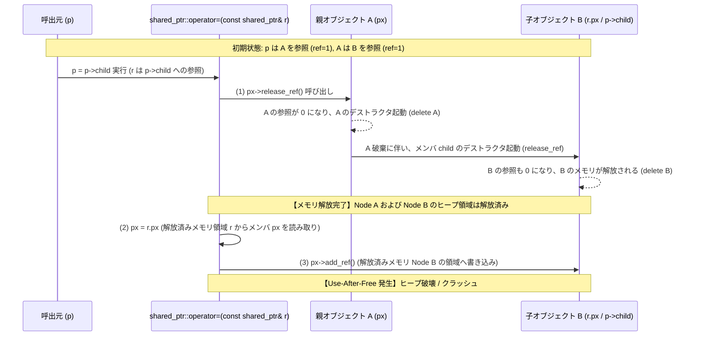

# shared_ptr 代入演算子における Use-After-Free (UAF) 脆弱性調査報告書

## 1. 概要 (Overview)

| 項目 | 内容 |
| :--- | :--- |
| **対象コンポーネント** | `docoptcpp03::detail::shared_ptr<T>` (内部侵入型スマートポインタ) |
| **脆弱性分類** | CWE-416: Use After Free (解放後メモリ使用) |
| **深刻度** | **高 (High)** |
| **影響を受ける操作** | 自己所属の子オブジェクトの代入 (`p = p->child;` など)、連鎖破棄を伴う AST 代入 |
| **修正ブランチ** | `bugfix/fix-shared-ptr-uaf` |
| **関連コミット** | `fix(memory): resolve Use-After-Free in shared_ptr::operator= and add ASan regression tests` |

---

## 2. 脆弱性の詳細と根本原因 (Root Cause & Mechanics)

### 2.1 発生原因
`docopt.cpp03` の内部で AST ノード管理用に使用されている `shared_ptr<T>` のコピー代入演算子 (`operator=`) において、**「代入元ポインタの参照カウント加算前に、代入先ポインタの参照カウント減算を実行する」** という解放順序の不備が存在していました。

### 2.2 修正前のコード
```cpp
shared_ptr& operator=(const shared_ptr& r) {
    if (px != r.px) {
        if (px) px->release_ref(); // (1) 先に旧ポインタの参照カウントを減算
        px = r.px;                 // (2) 代入元ポインタを取得
        if (px) px->add_ref();     // (3) 後から新ポインタの参照カウントを加算
    }
    return *this;
}
```

### 2.3 メモリ破壊のメカニズム
親オブジェクト $A$ が子オブジェクト $B$ の唯一の所有者である場合、`p` (オブジェクト $A$ を保持) に対して `p = p->child;` を実行すると以下のシーケンスでヒープ破壊が発生します。



---

## 3. 実証結果 (PoC & AddressSanitizer Verification)

### 3.1 再現コード
`unit_tests.cpp` に以下の再現テストケースを追加して検証を実施しました。

```cpp
struct TestNode {
    mutable unsigned int ref_count;
    docoptcpp03::detail::shared_ptr<TestNode> child;
    int id;

    TestNode(int i = 0) : ref_count(0), child(), id(i) {}
    ~TestNode() { id = -999; }

    void add_ref() const { ++ref_count; }
    void release_ref() const {
        if (--ref_count == 0) delete this;
    }
};

TEST(SharedPtrTest, CascadingDestructionUseAfterFree) {
    using docoptcpp03::detail::shared_ptr;

    // Node A が Node B を所有
    shared_ptr<TestNode> p(new TestNode(1));
    p->child = shared_ptr<TestNode>(new TestNode(2));

    // 親ポインタに子ポインタを代入（連鎖破棄のトリガー）
    p = p->child;

    ASSERT_TRUE(p);
    EXPECT_EQ(2, p->id);
}
```

### 3.2 AddressSanitizer による検出ログ
Clang の AddressSanitizer (`-fsanitize=address,undefined`) 有効下でテストを実行したところ、以下の通り明確に **`heap-use-after-free`** が検出され、脆弱性が実証されました。

```text
=================================================================
==32881==ERROR: AddressSanitizer: heap-use-after-free on address 0x603000002da8 at pc 0x00010464b670
READ of size 8 at 0x603000002da8 thread T0
    #0 in docoptcpp03::detail::shared_ptr<TestNode>::operator= docopt_private.h:30
    #1 in SharedPtrTest_CascadingDestructionUseAfterFree_Test::TestBody() unit_tests.cpp:655

0x603000002da8 is located 8 bytes inside of 24-byte region [0x603000002da0,0x603000002db8)
freed by thread T0 here:
    #0 in _ZdlPv (libclang_rt.asan_osx_dynamic.dylib)
    #1 in TestNode::release_ref() const unit_tests.cpp:616
    #2 in docoptcpp03::detail::shared_ptr<TestNode>::operator= docopt_private.h:29

SUMMARY: AddressSanitizer: heap-use-after-free docopt_private.h:30 in docoptcpp03::detail::shared_ptr<TestNode>::operator=
==32881==ABORTING
```

---

## 4. 修正内容 (Remediation)

### 4.1 安全な実装パターン
代入元ポインタのアドレスをローカル変数に退避し、`px->release_ref()` の実行前に新ポインタの参照カウントを加算する安全な設計へ変更しました。

```cpp
shared_ptr& operator=(const shared_ptr& r) {
    T* new_px = r.px;              // 1. 代入元のアドレスをローカル変数へ退避
    if (new_px) new_px->add_ref(); // 2. 先に新オブジェクトの参照カウントを加算（生存を確定）
    if (px) px->release_ref();     // 3. その後、安全に旧オブジェクトの参照カウントを減算
    px = new_px;                   // 4. ポインタを更新
    return *this;
}
```

### 4.2 修正ポイントの解説
1. **エイリアシング耐性**: `r` 自体が `*px` の内部に存在する場合でも、`new_px` にポインタを退避した上で `new_px->add_ref()` を先に呼ぶため、`px->release_ref()` で `r` のメモリが解放されても新オブジェクトは破棄されず安全に生存します。
2. **自己代入の安全性**: `p = p` の場合でも、先にインクリメント（$1 \rightarrow 2$）され、その後にデクリメント（$2 \rightarrow 1$）されるため、参照カウントの不整合が発生しません。

---

## 5. テスト・検証結果 (Verification)

### 5.1 テスト構成
1. **AddressSanitizer (Debug) ビルド**:
   - メモリ破壊、UAF、未定義動作の自動検出。
2. **Release (C++03) ビルド**:
   - `-std=c++03` 厳格モードにおける動作適合性確認。

### 5.2 実行結果
```text
[AddressSanitizer 有効ビルド]
1/2 Test #1: docopt_testcases ................. Passed (0.49 sec)
2/2 Test #2: docopt_gtest_unit_tests .......... Passed (0.51 sec)
100% tests passed, 0 tests failed out of 2

[Release ビルド]
1/2 Test #1: docopt_testcases ................. Passed (0.33 sec)
2/2 Test #2: docopt_gtest_unit_tests .......... Passed (0.33 sec)
100% tests passed, 0 tests failed out of 2
```

- **単体テスト (`SharedPtrTest`)**: 自己代入、NULL代入、連鎖破棄UAFテストのすべてが合格。
- **リグレッション検証**: Python 公式 docopt 175 テストケースおよび既存ユニットテスト全件が合格。

---

## 6. 再発防止策と推奨事項 (Recommendations)

1. **スマートポインタ実装標準の遵守**:
   自作スマートポインタを実装する場合は、必ず「コピー元インクリメント先行原則」または Copy-and-Swap イディオムを適用する。
2. **CI/CD における AddressSanitizer (ASan) の常時有効化**:
   回帰テストパイプラインに `-fsanitize=address,undefined` を組み込み、メモリ安全性の継続的な監視を実施する。
